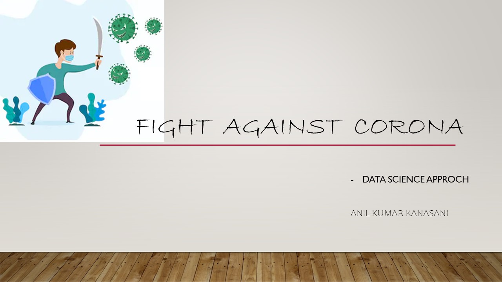

# Introduction

## Together against Corona

COVID-19 affects different people in different ways. People from different countries need information about the current  situation. So that they can be react immediately based on the situation.  The information should be more accurate, reliable and it should be always available.

As a computer application development professional, I developed a real time corona information. I used various official online data sources. I checked the reliability of the data sources.&#x20;

At the end of this project, you can find all the important real time information on the coronavirus pandemic, the coronavirus vaccination and coronavirus tests.

<figure><figcaption></figcaption></figure>

